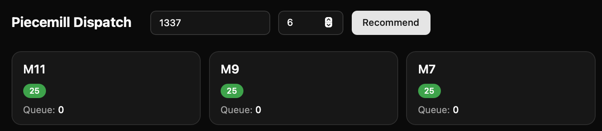

# Piecemill

Production scheduling optimizer for 12 laser cutting machines at a wooden jigsaw puzzle factory. Used daily on a real production floor.

## What it does

A worker walks up with a stack of puzzle panels that need to be cut. They enter the panel template number and quantity. Piecemill scores all 12 machines and recommends which one will finish the job fastest — factoring in each machine's current queue depth, the cut duration for that specific template, and individual machine speed.

The recommended machine is highlighted on the dashboard. Each card shows the machine's speed setting and how many jobs are queued.

## How the scoring works

Each laser machine runs at a different speed. Cut times are stored per template as a baseline duration at 25% speed (the maximum safe speed for the wood we use). The algorithm:

1. Calculates each machine's **committed time** — every queued job's cut duration, adjusted for that machine's actual speed
2. Calculates the **incoming job's time** on each machine, same speed adjustment
3. Scores each machine as `committed_time + incoming_time`
4. Returns the machine(s) with the lowest total score, tie-broken by machine ID

A `rank=full` mode returns all 12 machines sorted, not just the top pick.

## Stack

- **Frontend:** React, TypeScript, Vite, Tailwind, shadcn/ui
- **Backend:** Go, PocketBase
- **Hosted on:** Rocky Linux (Hostinger)
